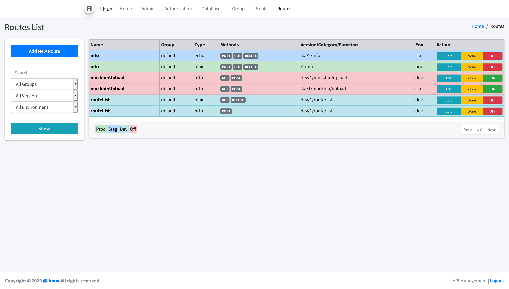
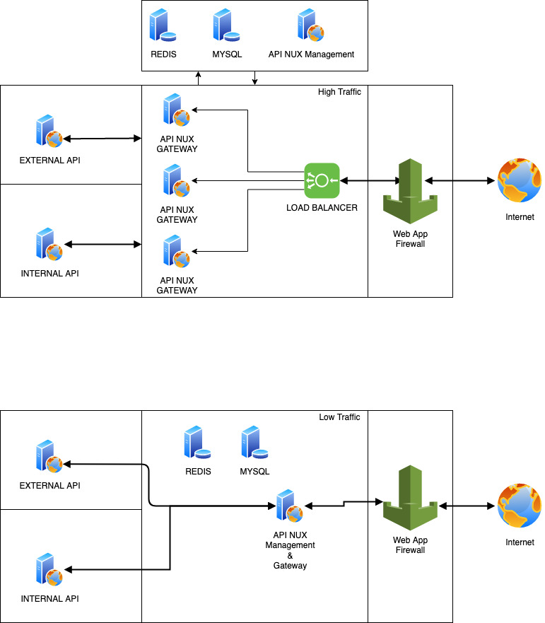

# PHP API GATEWAY & MANAGEMENT 

Web Apps for managing multiple API into 1 gateway
with simple versioning API
you can use SMTP login to login into API Gateway

it make simple to control your api
or creating api from database

# ENDPOINT

### production
`/1/user/add`

### Staging
`/sta/1/user/add`

### Developement
`/dev/1/user/add`

### Web admin
`/admin`

# TOPOLOGY

# Requirement

 - Apache with mod_rewrite or NGINX
 - PHP 7 or above
 - MySQL/MariaDB database
 - php-imap installed if using email login

# INSTALATION

- Git Clone or download from Release
- install Composer
- run `composer install`
- copy **config.example.php** to **config.php**
- edit config.php
- import `api_management.sql`
- open your domain where API gateway installed https://domain/admin/
- must installed in root folder of the web
- Username and password `me@ibnux.net`

### GNU Affero General Public License v3.0 
